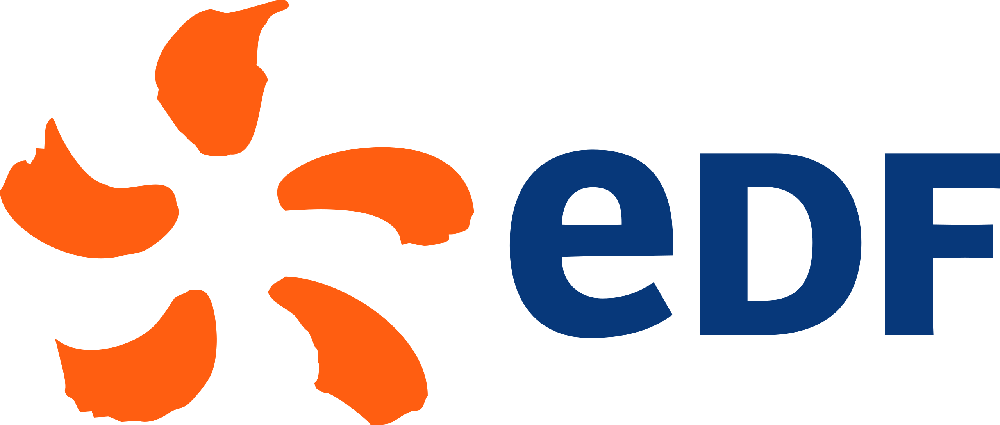

## ⚠️ Confidentialité et Restrictions
### Il est important de noter qu'une grande partie de ce projet est confidentielle en raison des exigences de sécurité et des clauses de confidentialité liées au secteur nucléaire. De ce fait, certaines parties essentielles du code, telles que la gestion de l'interface utilisateur (IHM), la gestion des composants et d'autres fonctionnalités sensibles, ne sont pas publiées sur ce dépôt GitHub.

### Ce dépôt sert principalement de vitrine pour présenter le projet dans son ensemble et en exposer les principes fondamentaux. Il permet ainsi de partager des informations générales et de montrer l’architecture du système, mais ne reflète pas l'intégralité de l'implémentation qui reste réservée dans un cadre sécurisé.

## 📷 Data et Photo 
### La data et les photos utilisées pour l’entraînement du modèle ne sont pas incluses dans ce dépôt GitHub. Ces données sont considérées comme sensibles, et leur diffusion publique pourrait compromettre la sécurité des opérations dans les centrales.                                                                                                                                                         Ce dépôt GitHub est uniquement destiné à présenter l’architecture et les technologies employées dans le projet, sans exposer de données sensibles ou protégées.

### Merci de comprendre ces restrictions liées à la confidentialité.

---
<p align="center">
  
</p>

# EDF - Convolutional Neural Network (CNN) ⚡️

**One More Time** est un projet développé pour **EDF**, et plus précisément pour le **service prévention des risques**, l’objectif est de développer un système de **contrôle automatique de la présence et du bon fonctionnement des équipements de protection** des agents entrant en zone radioactive.

Ce projet contribue à renforcer la sécurité des agents travaillant en zone "chaude" et à limiter les coûts cachés engendrés par les oublis ou dysfonctionnements des équipements.

---

## 🏗️ Une Réalisation "End-to-End" : De l'Idée au Déploiement

Ce projet a été intégralement conçu, développé et assemblé par **Louis Butin, Lilian Houbeaux Bachetti, Aurelien Musset et Christian Riviere,** opérant en totale autonomie. Nous avons assuré la maîtrise d'œuvre complète du système, transformant un besoin métier complexe en une solution industrielle prête à l'emploi.

### **Ingénierie Mécanique & Design (CAO/FAO)**
* **Conception Produit :** Imagination de la solution globale, études d'ergonomie pour les agents et design industriel du dispositif.
* **CAO (Conception Assistée par Ordinateur) :** Modélisation 3D complète du boîtier sous logiciel professionnel pour intégrer l'ensemble des composants.
* **FAO (Fabrication Assistée par Ordinateur) :** Programmation et pilotage des machines-outils pour l'usinage numérique du boîtier final.

### **Systèmes Embarqués & Hardware**
* **Conception Matérielle :** Sélection et intégration des composants (micro-ordinateur, caméra industrielle, capteurs de présence, boutons de commande).
* **Automatisme & Électronique :** Conception des circuits, gestion des relais de puissance et pilotage de vérins pneumatiques via signaux analogiques.
* **Fiabilité Industrielle :** Implémentation matérielle de la redondance critique pour garantir un fonctionnement 24h/24 et 7j/7.

### **Intelligence Artificielle & Data Factory**
* **Data Mining In-Situ :** Campagnes de récolte de données directement sur le terrain en centrale nucléaire.
* **Data Labeling :** Indexation et labellisation manuelle de milliers d'images pour créer un dataset propriétaire robuste.
* **Deep Learning :** Entraînement et optimisation du modèle CNN (PyTorch) pour répondre aux exigences de précision du secteur nucléaire.

### **Gestion de Projet & Supply Chain**
* **Sourcing & Achats :** Recherche de fournisseurs, comparaison technique des composants, gestion du budget et des délais d'approvisionnement.
* **Analyse de Sûreté :** Conception des protocoles de sécurité et définition des modes de fonctionnement (Normal, Dégradé, Maintenance).
* **Documentation Technique :** Rédaction de l'intégralité des dossiers de conception et des manuels d'exploitation industrielle.

---

> **Note sur la polyvalence :** Ce projet témoigne de notre capacité à gérer un cycle de développement complet, alliant **compétences logicielles avancées** (IA, Vision) et **maîtrise des contraintes physiques** (Usinage, Électronique, Maintenance).

## 🔧 Principe 
Pensé comme une solution **clé en main**, un boîtier usiné embarque tous les éléments du système dans un format compact et robuste. Ce boîtier intègre l’ensemble des composants essentiels au fonctionnement du système, depuis le micro-ordinateur jusqu’à la caméra et ses capteurs, en passant par les relais, boutons de commande, interfaces USB, éléments de redondance et écran d’affichage sécurisé. L’ensemble est conçu pour garantir la **fiabilité, la maintenabilité et la durabilité** du dispositif, tout en facilitant les interventions techniques grâce à une **architecture optimisée et accessible**. Le boitier est relié à une porte papillon et pilote l'accès aux zones controlées à l'aide d'un signal analogique et d'un verrin pneumatique.

## 🛡️ Fiabilité et redondance dans le contexte nucléaire 
Dans le secteur nucléaire, la fiabilité et la redondance sont des impératifs absolus pour garantir la sûreté des opérations. Le boîtier a donc été conçu pour répondre à ces exigences :

- Redondance des capteurs critiques afin d'assurer la détection même en cas de défaillance d'un composant.
- Choix de composants éprouvés, pour la fiabilité et la disponibilité à long terme.
- Sécurisation mécanique et électronique des éléments fragiles (caméra, connectiques), pour limiter les déconnexions ou erreurs de lecture.
- Boîtier usiné unique qui protège l'ensemble des composants et simplifie la maintenance.
Cette approche garantit une exploitation sécurisée du dispositif, conforme aux exigences élevées du milieu nucléaire.


Le boîtier est conçu pour un fonctionnement 24 heures sur 24, 7 jours sur 7, sur une très longue période de plusieurs années, sans interruption.
Dans l’environnement exigeant du nucléaire, où la moindre défaillance peut avoir des conséquences critiques, la fiabilité est une priorité absolue.
Pour cela, il embarque de multiples modes de fonctionnement pour garantir la continuité de service : 

- ✅ Mode normal : fonctionnement optimal avec tous les composants opérationnels.
- ⚙️ Mode dégradé : permet au système de continuer à fonctionner partiellement en cas de panne d’un ou plusieurs sous-systèmes critiques.
- 🔄 Mode bypass : désactive temporairement certaines sécurités ou automatismes pour maintenir un fonctionnement minimum du boîtier, dans l’attente d’une intervention de maintenance.
- 🛠️ Mode maintenance : mode spécifique pour faciliter la vérification rapide de l’état du système. Il permet d’avoir un diagnostic clair et immédiat des composants défectueux ou en fin de vie, simplifiant ainsi les opérations de maintenance préventive et corrective

## 🚀 Fonctionnalités
- **Détection automatique** de la présence d'équipement de sécurité de l’agent.
- **Vérification du bon fonctionnement** des équipements.
- Réduction des risques liés à l’oubli ou au défaut d’activation des équipements.
- Diminution des coûts opérationnels liés aux procédures correctives.

## 📊 Collecte des données et processus de Data Mining
Dans le cadre du développement de ce projet, une grande partie des données nécessaires à l'entraînement de notre modèle a été collectée directement en centrale nucléaire, sur le terrain. Le processus de data mining a été une étape essentielle, visant à obtenir des informations concrètes sur le terrain pour garantir la performance du modèle.
Nous avons capturé une série de photos des équipements en fonctionnement dans des conditions variées et dans la totalité des configurations d’opération. Ces photos ont permis de créer un ensemble de données des différents états possibles, qu'ils en fonctionnement optimal ou potentiellement défectueux.

Les photos ont été prises en prenant en compte des critères techniques tels que l'éclairage, l'angle de prise de vue et la résolution, pour simuler au plus près les conditions réelles d’utilisation. Elles ont ensuite été traitées pour extraire les informations pertinentes. Un pré-traitement de l’image a également été effectué, notamment pour redimensionner les photos et améliorer la qualité des images prises dans des conditions de faible luminosité.

## 🧑‍💻 Technologies utilisées
- **Langage** : Python
- **Deep Learning** : PyTorch
- **Réseaux de neurones** : Convolutional Neural Network (CNN)
- **Traitement d’image** : OpenCV
- **Matériel** : Caméra pour la détection visuelle


## 📂 Installation

### 📌 Prérequis
Assurez-vous d'avoir **Python (>= 3.8)** installé.  
Vérifiez la version avec :
```bash
python --version
